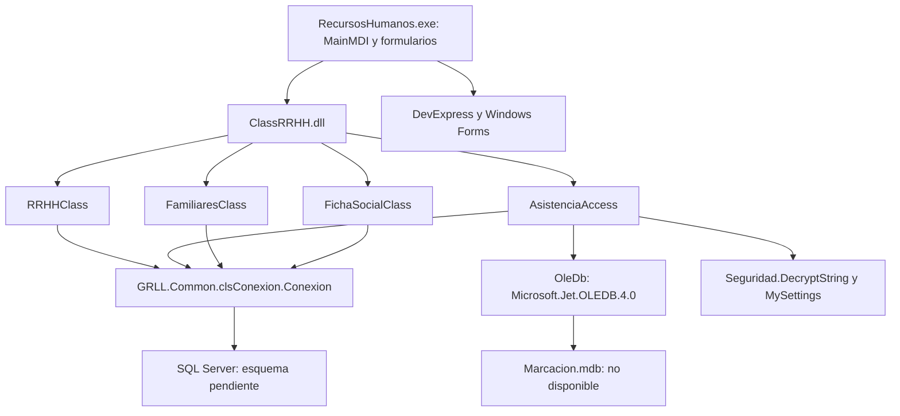

# Arquitectura observada en el legado

El diagrama reúne referencias entre ensamblados y dependencias observadas en el código de `ClassRRHH.dll`. La interfaz se identifica mediante metadatos; sus cuerpos no se recuperan íntegramente en esta etapa. No representa una arquitectura nueva.

| Componente | Qué se observa | Límite |
| --- | --- | --- |
| `RRHHClass` | 55 métodos públicos de negocio y dos propiedades; consultas de empleados, permisos, asistencia y reportes. | Es una clase del ensamblado, no la totalidad del producto ni su esquema relacional. |
| `AsistenciaAccess` | Diez métodos públicos de negocio; captura/actualización Access y cuatro importaciones a SQL. | Las rutas/configuraciones se obtienen de settings; no se abrió un MDB real. |
| `FamiliaresClass` | Tres operaciones de consulta sobre parentescos y personas/familiares. | Nombres y joins no acreditan claves físicas ni reglas completas. |
| `FichaSocialClass` | Una operación para recuperar familiares mediante un procedimiento. | No representa toda la generación de ficha social. |
| `GRLL.Common.clsConexion` | Proporciona la conexión SQL usada por los constructores. | Se usa como dependencia original para compilar; sus cuerpos no se publican como fuente nueva. |
| `Seguridad` y `MySettings` | Los constructores recuperan rutas y valores Jet a partir de defaults codificados. | No se descifraron ni publicaron los valores. La fuente de settings se conserva cifrada. |

Fuentes: [clases recuperadas](../../src/v1/README.md), [metadatos propios](../../evidencia/ingenieria_inversa/ensamblados_propios.json) y [contratos observados](../../evidencia/ingenieria_inversa/contratos_observados.json).

## Flujo estático de importación

En `Access2Sql`, el cliente abre Access, genera una tabla de comandos de importación de asistencia, abre SQL y ejecuta cada comando. Después genera y ejecuta comandos de marcación. En la ruta normal cierra las conexiones y devuelve `true`; las capturas de excepciones devuelven `false` mediante salida del flujo. Este recorrido se lee en el código, no se observó con datos reales.

Las consultas construyen texto `EXEC`; no se debe describir este flujo como llamada parametrizada uniforme a procedimientos ni asumir transacción, idempotencia o garantía de cierre en toda salida. Las variantes SEDE, PROIND y CONSEJO deben compararse antes de extraer un método común: rutas, consultas y tratamiento de datos pueden diferir.

## Qué se conserva para la siguiente etapa

Una refactorización deberá delimitar un método o flujo, conservar sus entradas y resultados comprobables y registrar cualquier cambio de comportamiento. La selección no puede partir de una clase monolítica inventada ni de un contrato SQL deducido solo de un nombre. SRP/DRY permanece pendiente.
