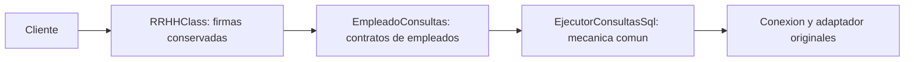

# Semana 04 — SRP y DRY en tres consultas de empleados

## Problema y objetivo

La clase recuperada `RRHHClass` mezcla consultas de empleados con asistencia, permisos y reportes. En los tres métodos seleccionados repite apertura de conexión, preparación del adaptador, creación de `DataTable`, `Fill` y cierre. Se separa un caso pequeño, conservando los contratos observados en v1.

La propuesta v2 previa modificaba consultas y tipos de parámetros, por lo que no acreditaba preservación del comportamiento. Se conserva como antecedente y se implementa un caso trazable contra [RRHHClass recuperada](../../../src/v1/recuperado/ClassRRHH/RRHHClass.cs). [Consigna de semana 04](../../../referencias/semanas/semana04/Semana04_EVO_TG.pdf).

La [comparación de la fachada](../../../evidencia/semanas/semana04/antes_despues.diff) muestra los tres cuerpos sustituidos, normalizando solo los finales de línea para facilitar la lectura. Las dos clases extraídas se encuentran en [src/v2](../../../src/v2/README.md).

## Antes y después

| Antes, v1 | Después, v2 | Motivo |
| --- | --- | --- |
| Tres métodos mezclados en `RRHHClass` definen consultas de empleados y ejecutan ADO.NET. | `RRHHClass` conserva sus métodos y delega a `EmpleadoConsultas`. | SRP: trasladar la definición de consultas del caso a una clase dedicada. |
| Preparar conexión/comando/adaptador y obtener `DataTable` se repite en cada método. | `EjecutorConsultasSql` concentra esa mecánica para las tres consultas. | DRY: una representación del procedimiento común, con sus diferencias explícitas. |
| El cliente encuentra los métodos y retornos originales. | Se mantienen nombres, argumentos y retornos públicos. | Evitar exigir cambios de llamadas solo para estudiar la separación. |

## Contratos conservados

| Método público | Consulta del cliente | Parámetro | Retorno de la fachada |
| --- | --- | --- | --- |
| `ObtenerEmpleados()` | Texto exacto `select idempleado,NombresC from vs_GetEmpleado where Estado=1`. | Ninguno. | `object`, cuyo valor es un `DataTable`. |
| `BuscarEmpleado_Codigo(int codigo)` | `spRRHH_BuscarEmpleado_Codigo`, `StoredProcedure`. | `@codigo`, `SqlDbType.Int`, valor recibido. | `DataTable`. |
| `spRRHH_ListarTrabajadores(int idTipoTrabajador)` | Procedimiento homónimo, `StoredProcedure`. | `@IdTipoTrabajador`, `SqlDbType.Int`, valor recibido. | `DataTable`. |

Los contratos se extraen de v1 y quedan asociados a su SHA-256 en [contratos_v1.json](../../../evidencia/semanas/semana04/contratos_v1.json). Su existencia y definición física en CMI siguen sin verificar.

La fachada pasa los valores actuales de `ObjCnn` y `objDA` en cada llamada; no introduce otra conexión ni almacena una copia que ignore cambios en esos campos públicos. Se mantiene apertura condicional en obtener/listar y apertura incondicional en buscar por código. Esas diferencias impiden reducir los métodos a un helper que abra y cierre de otra manera sin documentar un cambio adicional.

## Dónde se aplica cada principio

**SRP:** `EmpleadoConsultas` representa el conocimiento de las tres consultas y sus parámetros; `EjecutorConsultasSql` representa su ejecución común. No se afirma que toda `RRHHClass` cumpla SRP: el resto se conserva para limitar el cambio.

**DRY:** las tres secuencias de ejecución se reúnen en una. Se observa un `Fill`, un punto de apertura y un punto de cierre en el helper. Las tres consultas siguen siendo distintas; no se elimina su conocimiento ni se fuerza un procedimiento único. No se atribuyen ahorros de líneas, rendimiento o errores sin medición.

## Comprobaciones realizadas

- Biblioteca v2: 14 fuentes, cero errores y advertencias con Roslyn SDK10.0.103 y referencias instaladas Framework4.
- Once escenarios construyen comandos del código nuevo, cotejados contra los contratos extraídos de v1: consulta sin parámetros y cinco valores enteros —mínimo, -1, 0, 42 y máximo— para cada consulta parametrizada. Se comprueban texto, tipo de comando, nombre/tipo/dirección/valor de parámetros, conexión compartida y estado cerrado.
- Se compara la fachada completa con v1 excluyendo únicamente los tres cuerpos autorizados. Se mantienen firmas y todo el código fuera del caso.
- Los ocho antecedentes conservan su SHA-256. Su compilación separada confirma ocho `CS0246`; no se presentan como implementación activa.
- Se verifican conservación de v1/legado, JSON, enlaces y exclusiones de material privado.

[Resultados](../../../evidencia/semanas/semana04/README.md). El harness ejecuta solo las dos clases nuevas y código de comprobación; no ejecuta métodos recibidos, `RRHHClass`, GRLL ni consultas SQL.

## Aporte y límites

La mejora permite localizar y modificar las consultas de este caso sin repetir su ejecución ADO.NET. El punto compartido reduce lugares donde mantener esa mecánica y la fachada conserva la forma de llamada del cliente.

Se mantiene la gestión manual de conexiones y la política de excepciones del caso. No se añaden `finally`, transacciones ni garantías de cierre ante fallos; tampoco se vuelve segura para uso concurrente una conexión compartida. Hay dependencias concretas y creación con `new`: IoC/OCP quedan para sus etapas.

No se verificaron resultados reales, permisos, esquema SQL ni interfaz, y no se instaló la DLL en el sistema recibido. Las pruebas cubren contratos de construcción de comandos y la compilación, no equivalencia funcional completa. La v3 permanece pendiente de indicación del equipo.
