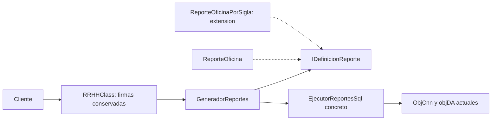

# Semana 05 — OCP en reportes de oficina

## Problema y objetivo

En la fachada v2, `Generar_Report_oficina` y `Generar_Report_oficina_Dep` definen cada procedimiento y parámetro junto con su ejecución ADO.NET. Incorporar otra definición por esa vía exige añadir lógica a la fachada. C04 crea un consumidor común de definiciones de reporte y demuestra que acepta la variante real por sigla sin modificar ni recompilar su núcleo.

La variante por sigla ya existía en v1: aquí se incorpora como segunda definición del punto de extensión. La mejora es de mantenimiento y extensibilidad del código; no se añade una funcionalidad empresarial nueva.

El [contrato C04](../../../specs/c04_ocp.json) delimita dos métodos sobre la base C03 `a5849d9`. La [propuesta anterior](../../../src/v3/antecedentes/README.md) se conserva como antecedente: compila, pero su reporte de oficina modifica procedimiento, parámetro y retorno respecto de v1.

La [guía de semana 05](../../../referencias/semanas/semana05/Semana05_EVO_TG.pdf) presenta OCP en la página 9, la práctica en las páginas 10–11 y la rúbrica en la página 12. Las páginas 10–11 contienen el rótulo erróneo «Semana 4»; se conserva el PDF y se referencia su contenido dentro de la guía de semana 05.

## Antes y después

| Antes, v2 | Después, v3 | Aporte |
| --- | --- | --- |
| Cada cuerpo define el comando y ejecuta SQL directamente. | La fachada conserva sus firmas y delega a `GeneradorReportes` con una definición tipada. | Separar la variante del consumidor común. |
| La definición de oficina está fijada en el método. | `ReporteOficina` implementa `IDefinicionReporte`. | Establecer el punto de extensión. |
| La variante por sigla repite la misma mecánica. | `ReporteOficinaPorSigla` implementa la misma interfaz; `EjecutorReportesSql` reúne `DataSet`, `Fill` y apertura/cierre. | Reutilizar el consumidor sin seleccionar tipos concretos. |

## Contratos conservados

| Firma de la fachada | Procedimiento, `StoredProcedure` | Parámetro recibido | Nombre suministrado a `Fill` |
| --- | --- | --- | --- |
| `object Generar_Report_oficina(int CodOficina)` | `spRRHH_Report_Oficina_Unico` | `@idarea`, `SqlDbType.Int`, `Input`. | `spRRHH_Report_Oficina_Unico` |
| `object Generar_Report_oficina_Dep(string Sigla)` | `spRRHH_Report_Oficina` | `@sigla`, `SqlDbType.VarChar`, `Input`. | `spRRHH_Report_Oficina` |

En ambos casos la ruta de ejecución devuelve un `DataSet` como `object` y abre/cierra incondicionalmente en la ruta normal. La fachada pasa las referencias actuales de sus campos públicos `ObjCnn` y `objDA`. No se añaden valores predeterminados, validaciones, normalización de siglas ni conversiones a `DBNull`. [Contratos extraídos de v1 y hashes](../../../evidencia/semanas/semana05/contratos_v1.json).

La [comparación v2/v3](../../../evidencia/semanas/semana05/antes_despues.diff) muestra solo los dos cuerpos sustituidos. Los helpers de empleados de v2 se reutilizan sin copiar; v1, v2 y las evidencias de las etapas anteriores permanecen intactos.

## Cómo se demuestra OCP

`IDefinicionReporte` expone `NombreTabla` y `CrearComando(SqlConnection)`. `GeneradorReportes.Preparar` trabaja con esa interfaz y devuelve un `ComandoReporte`; no contiene un `switch`, una lista fija ni comprobaciones de clases concretas. El conocimiento de cada procedimiento y parámetro reside en su definición.

La prueba compila primero cinco fuentes del núcleo, incluida únicamente `ReporteOficina`. Después compila `ReporteOficinaPorSigla` en otra DLL contra ese núcleo ya compilado. Un harness utiliza ambas implementaciones mediante el mismo `GeneradorReportes.Preparar`. Los hashes de la DLL y las cinco fuentes del núcleo coinciden antes y después; el núcleo no se recompila para aceptar la extensión.

OCP se demuestra respecto de este consumidor y esta extensión. La clase nueva y la composición que la selecciona sí se incorporan; no significa que ningún archivo de la aplicación cambie ni que una futura UI descubra reportes automáticamente.

## Comprobaciones y límites

La [evidencia ejecutada](../../../evidencia/semanas/semana05/README.md) registra biblioteca acumulativa de 20 fuentes sin errores ni advertencias, 11 escenarios aprobados, núcleo intacto, 18 antecedentes preservados y verificación `ok: true`. Los 17 C# del antecedente también compilan, sin acreditar compatibilidad de contratos.

Los escenarios prueban cinco enteros y seis siglas —incluyen `null`, vacío, Unicode, espacios y 1000 caracteres—. Comprueban procedimiento, tipo de comando, nombre/tipo/dirección/tamaño/valor del parámetro, referencia de conexión cerrada, adaptador sin modificación y nombre de tabla preparado. No acreditan validez de esas entradas en el servidor.

El harness ejecuta código nuevo de preparación: no llama `Generar`, `Fill`, `RRHHClass`, GRLL ni código recibido. `DataSet`, `Fill` y apertura/cierre se contrastan mediante fuente y compilación; no se prueban con SQL. Preparar el comando ahora precede a `Open`, por lo que no se afirma equivalencia de todos los fallos. Se mantienen gestión manual de conexiones y dependencias SQL concretas; tampoco se verifican esquema, resultados, permisos, UI, despliegue, framework original o equivalencia funcional completa.

`GeneradorReportes` aún crea `new EjecutorReportesSql`. La interfaz de definición sirve al caso OCP; no constituye la entrega IoC de semana 07. C04 se limita al cuarto commit y debe detenerse tras su publicación y explicación.
