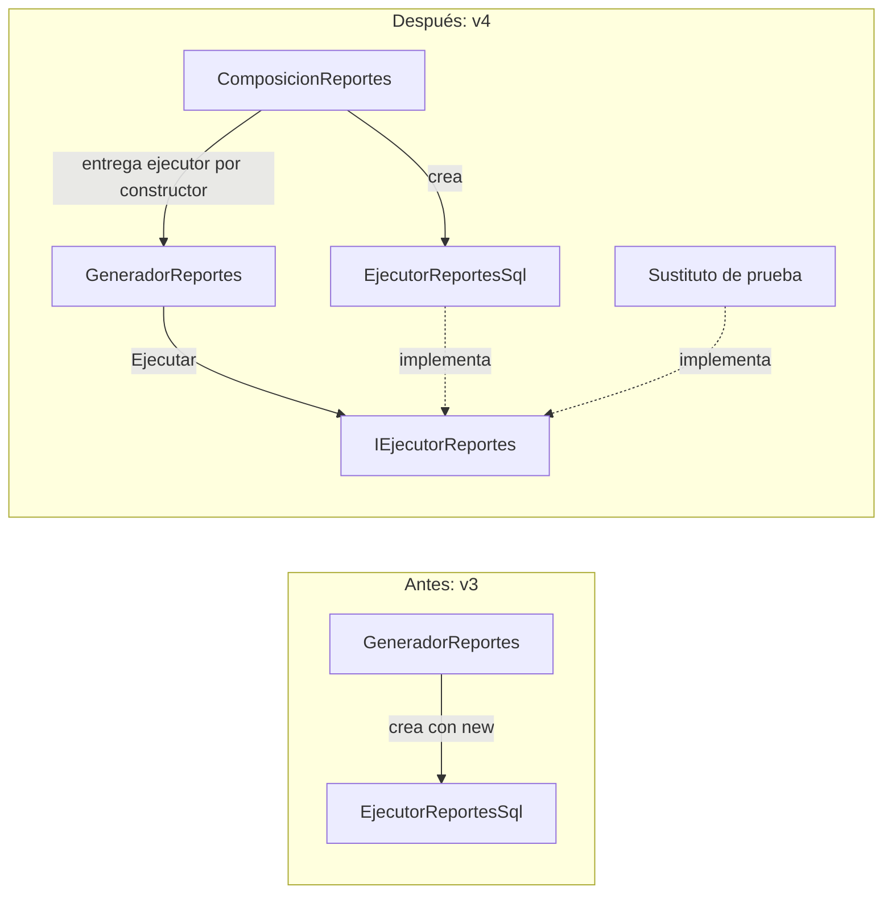

# Semana 07: inversión de control en la ejecución de reportes

## Problema y objetivo

En v3, `GeneradorReportes` prepara reportes mediante `IDefinicionReporte`, pero guarda un `EjecutorReportesSql` concreto y lo crea dentro de su constructor. Por ello, llamar `Generar` fija la ejecución SQL: no se puede entregar un sustituto para comprobar el flujo completo sin abrir una conexión.

El [contrato C05](../../../specs/c05_ioc.json) selecciona únicamente esa dependencia sobre la base C04 `7bd215a0d7aebb47fd99309c0a3ed661304cfb19`. La mejora permite entregar un `IEjecutorReportes` desde fuera del generador. `ComposicionReportes` selecciona y crea la implementación SQL para las dos delegaciones existentes de `RRHHClass`.

La [guía de semana 07](../../../referencias/semanas/semana07/Semana07_EVO_TG.pdf) establece el objetivo IoC en la página 8, las preguntas teóricas en la página 9 y la práctica acotada en las páginas 10-11. Solicita identificar una dependencia directa y mostrar su mejora, sin presentar avances generales del proyecto. La rúbrica de la página 12 valora organización, dominio y respuestas, calidad visual y participación. Las conclusiones de la página 13 mencionan OCP; este informe se basa en la consigna específica de IoC de las páginas anteriores.

El [guion de exposición](02_guion_exposicion.md) y la [presentación local](Semana07_IoC_RRHH.pptx) organizan el caso en seis diapositivas: objetivo, creación fija, inyección por constructor, composición, demostración y límites.

## Antes y después

Fragmento exacto de [v3](../../../src/v3/caso_reportes/GeneradorReportes.cs):

```csharp
    private readonly SqlConnection _conexion;
    private readonly EjecutorReportesSql _sql;

    public GeneradorReportes(SqlConnection conexion, SqlDataAdapter adaptador)
    {
        _conexion = conexion;
        _sql = new EjecutorReportesSql(conexion, adaptador);
    }
```

Fragmento exacto de [v4](../../../src/v4/caso_ioc/GeneradorReportes.cs):

```csharp
    private readonly SqlConnection _conexion;
    private readonly IEjecutorReportes _sql;

    public GeneradorReportes(SqlConnection conexion, IEjecutorReportes sql)
    {
        _conexion = conexion;
        _sql = sql;
    }
```

La nueva [interfaz](../../../src/v4/caso_ioc/IEjecutorReportes.cs) contiene un solo método:

```csharp
public interface IEjecutorReportes
{
    DataSet Ejecutar(ComandoReporte reporte);
}
```

La [composición](../../../src/v4/caso_ioc/ComposicionReportes.cs) mueve la creación fuera del consumidor:

```csharp
    public static GeneradorReportes CrearSql(SqlConnection conexion, SqlDataAdapter adaptador)
    {
        var sql = new EjecutorReportesSql(conexion, adaptador);
        return new GeneradorReportes(conexion, sql);
    }
```

`Preparar` y `Generar` se conservan. El flujo de `Generar` sigue siendo:

```csharp
        return _sql.Ejecutar(Preparar(reporte));
```



| Concepto | Aplicación en este caso |
| --- | --- |
| Inversión de control, IoC | El generador recibe su ejecutor; la decisión de crearlo y seleccionarlo queda fuera de él. |
| Inyección de dependencias, DI | El constructor es el mecanismo utilizado para entregar esa dependencia. |
| Interfaz y abstracción | `IEjecutorReportes` expresa la operación que necesita el generador y admite implementaciones diferentes. |
| Relación con DIP | El consumidor depende del contrato para la ejecución, en lugar de nombrar la clase ejecutora concreta. La mejora se limita a esa dependencia. |

La composición es manual; no se incorpora un contenedor. La creación concreta permanece en un lugar explícito y revisable. La interfaz anterior `IDefinicionReporte` se reutiliza para preparar comandos, mientras la interfaz nueva permite sustituir su ejecución.

## Comportamiento conservado y cambio intencional

Las firmas de la fachada siguen siendo `object Generar_Report_oficina(int CodOficina)` y `object Generar_Report_oficina_Dep(string Sigla)`. Solo cambian sus dos cuerpos para llamar a `ComposicionReportes.CrearSql(ObjCnn, objDA)`. Se mantienen las referencias compartidas de conexión y adaptador y las definiciones de los dos reportes.

| Reporte | Procedimiento y nombre de tabla | Parámetro |
| --- | --- | --- |
| Por código de oficina | `spRRHH_Report_Oficina_Unico` | `@idarea`, `SqlDbType.Int`, `Input`; conserva el entero recibido. |
| Por sigla | `spRRHH_Report_Oficina` | `@sigla`, `SqlDbType.VarChar`, `Input`; conserva el texto recibido, incluido `null`. |

Ambos comandos mantienen `CommandType.StoredProcedure`. Los [contratos observados en v1](../../../evidencia/semanas/semana05/contratos_v1.json) se reutilizan, con su hash registrado en [procedencia](../../../evidencia/semanas/semana07/procedencia.json). No se añaden defaults, validaciones, normalización, conversiones a `DBNull` ni reglas de aceptación del servidor.

El constructor público de `GeneradorReportes` cambia de `(SqlConnection, SqlDataAdapter)` a `(SqlConnection, IEjecutorReportes)`. Sus consumidores de composición deben adaptarse; no se promete compatibilidad binaria de ese componente. Las firmas originales de la fachada sí se conservan. La biblioteca es diagnóstica y no reemplaza la DLL instalada del legado.

`EjecutorReportesSql` implementa la interfaz, pero conserva su constructor y el cuerpo de `Ejecutar`: `Open`, creación de `DataSet`, asignación de `SelectCommand`, `Fill` y `Close` en la ruta normal. `ComandoReporte` conserva su ciclo de vida actual. Esta etapa no introduce `using` o `finally` en esa ruta ni corrige la gestión manual de la conexión.

## Verificación y alcance

La [compilación y pruebas registradas](../../../evidencia/semanas/semana07/compilacion_y_pruebas.json) muestran biblioteca acumulativa de 22 fuentes y harness de 10 fuentes, ambas sin errores ni advertencias, con 16 escenarios aprobados y salida 0. La [verificación](../../../evidencia/semanas/semana07/verificacion_v4.json) registra `ok: true`, ocho hashes de antecedentes comprobados y ninguna modificación de los archivos de etapas anteriores. También confirma firmas y resto de fachada conservados, cambio mínimo del generador y constructor/cuerpo SQL conservados. La [guía de evidencias](../../../evidencia/semanas/semana07/README.md) distingue fuente, compilación y flujo ejecutado.

El [harness versionado](../../../src/v4/pruebas/PruebasIoC.cs) llama `Generar` con un ejecutor sustituto: registra la solicitud y entrega un `DataSet` sintético. Once escenarios verifican los contratos observados en v1, una llamada por reporte y la identidad de la respuesta. Los cinco restantes comprueban dos instancias de la misma clase de generador con ejecutores diferentes, `Preparar` sin ejecución, propagación del error del ejecutor, composición SQL con conexión cerrada y fallo de preparación sin llamadas al ejecutor. La mecánica real de `Fill` se conserva mediante comparación de fuente y compilación; no se valida contra CMI.

Persisten `SqlConnection` y `SqlCommand`: se desacopla `GeneradorReportes` de su ejecutor propio, sin acreditar compatibilidad con otros motores. Los datos sintéticos no prueban resultados SQL, esquema, reglas, permisos o equivalencia funcional completa. Tampoco se ejecutan la fachada, UI, ensamblados recibidos o despliegue del legado.

El [antecedente v4](../../../src/v4/antecedentes/README.md) se conserva como borrador incompleto, fuera de la compilación activa. Sus declaraciones de contenedor y composición no constituyen evidencia de implementación. Las etapas C01-C04 conservan sus archivos. El equipo autorizó incorporar esta entrega como quinto commit mediante PR desde `semana-07-ioc` y squash hacia `main`; el [detalle del commit](03_preparacion_quinto_commit.md) explica el cambio y su proceso de publicación.
